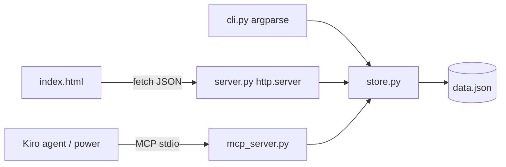

# Design: StudyStreak

## Overview
Four thin layers over one store module. The app is standard library only;
Hypothesis is a test-only dependency.



## Data model
```python
@dataclass
class Session:
    id: str        # uuid4 hex
    subject: str   # 1..60 chars, trimmed
    minutes: int   # 1..1440
    date: str      # ISO YYYY-MM-DD, not in the future
    note: str = "" # 0..200 chars
```
File format: `{"version": 1, "sessions": [ ...Session dicts... ], "weekly_goal": int | null}`
(`weekly_goal` is optional; files without it load as no goal.)

## store.py
- `ValidationError(ValueError)` for bad input.
- `make_session(subject, minutes, date=None, note="", today=None) -> Session` validates and builds.
- `Store(path)`: `load()`, `add(...)`, `list()`, `delete(id) -> bool`, `stats(today=None) -> dict`.
- `compute_streak(dates: set[date], today: date) -> int`.
- `save()` writes to `path.tmp` then `os.replace` for atomicity.
- `today` is injectable everywhere so date logic is testable.

## server.py API (127.0.0.1:8765)
| Method | Path | Body | Response |
|---|---|---|---|
| GET | / | | index.html |
| GET | /api/sessions?subject= | | `[Session]` (optional case-insensitive subject filter) |
| GET | /api/daily?days=7 | | `[{date, minutes}]` oldest first, zero-filled, days 1..90 / 400 (`Store.daily`) |
| GET | /api/subjects/{name} | | 200 `{subject, total_minutes, sessions, average_minutes, streak, longest_streak, first_date, last_date}` / 404 |
| POST | /api/sessions | `{subject, minutes, date?, note?}` | 201 `Session` / 400 `{error}` |
| PATCH | /api/sessions/{id} | any of `{subject, minutes, date, note}` | 200 `Session` / 400 / 404 (`Store.update`) |
| DELETE | /api/sessions/{id} | | 204 / 404 `{error}` |
| GET | /api/stats | | `{total_minutes, sessions, by_subject, streak, longest_streak, week}` |
| GET | /api/overview | | `{generated, total_minutes, sessions, streak, longest_streak, week, top_subjects, recent_days}` (`Store.overview`) |
| GET | /api/export.csv | | 200 `text/csv` attachment (`Store.export_csv`) |
| PUT | /api/goal | `{minutes: int \| null}` | 200 `{weekly_goal}` / 400 `{error}` |

`week` is `{start, minutes, goal, percent}`. `start` is the Monday of the current week;
`percent` is `min(100, round(100 * minutes / goal))` or `null` when no goal is set.
`Store.set_goal(minutes)` validates 1..10080 or `None` to clear.

Request bodies are capped at 10 KB. Unknown paths return 404.

## mcp_server.py (MCP over stdio)
JSON-RPC 2.0, one message per line. Supports `initialize` (protocol 2025-06-18, falls back
for 2025-03-26 / 2024-11-05), `ping`, `tools/list`, `tools/call`; notifications get no reply.
stdout carries protocol only, diagnostics go to stderr. A new `Store` is opened per call so
changes from the CLI or web UI are always visible.

| Tool | Store method | Notes |
|---|---|---|
| `log_session` | `add` | subject, minutes required |
| `list_sessions` | `list(subject)` | `limit` 1..100, default 20 |
| `get_stats` | `stats` | |
| `daily_breakdown` | `daily(days)` | days 1..90, default 7 |
| `set_weekly_goal` | `set_goal` | `minutes` required, null clears |

Validation failures and unexpected arguments return `isError: true` with the message, so
the model can correct itself. Unknown tools and bad params are JSON-RPC errors (-32602).
Installed as the `studystreak-mcp` console script via `pyproject.toml`.

## Correctness properties
Checked with Hypothesis in `tests/test_properties.py` (150 random cases each, shrunk on failure).

| # | Property | Validates |
|---|---|---|
| P1 | Any in-range input is accepted and stored trimmed with exact values | 1.1, 1.2 |
| P2 | Minutes outside 1..1440 are always rejected | 1.5 |
| P2b | A control character in subject or note is always rejected | 1.7 |
| P3 | Dates after today are always rejected | 1.6 |
| P4 | A rejected edit changes no session in memory or on disk | 12.2, 12.4 |
| P5 | Save then load returns identical sessions and goal; no temp file left | 5.1, 5.2, 7.1 |
| P6 | total = sum of sessions = sum of per-subject totals; subjects unique, sorted | 4.1 |
| P7 | Streak equals a reference implementation and never exceeds longest streak | 4.2, 4.3, 9.1 |
| P8 | Logging today never lowers the streak and makes it at least 1 | 4.2 |
| P9 | Weekly percent is null without a goal, else within 0..100 | 7.4 |
| P10 | Daily breakdown covers exactly N consecutive days ending today | 13.1, 13.2 |
| P11 | List is newest first; subject filters partition all sessions | 2.1, 10.1-10.3 |
| P12 | CSV parses back to the same rows; formula-like cells are prefixed | 8.1-8.3 |

P12 found two real bugs, both fixed with regression tests in `test_store.py`: a bare `\r`
in a note split a CSV row, and a NUL character crashed the exporter. Control characters
are now rejected at input (Requirement 1.7).

## Error handling
- Validation errors map to exit code 2 in the CLI and HTTP 400 in the API.
- Corrupt JSON file: raise a clear error naming the file instead of overwriting user data.

## Testing
- `test_store.py`: validation boundaries, persistence round-trip, delete, stats grouping, streak cases.
- `test_server.py`: start `ThreadingHTTPServer` on port 0 in a thread, exercise every endpoint.
- `test_mcp_server.py`: handler unit tests plus an end-to-end run over real stdio.
- `test_properties.py`: the correctness properties above (skipped if Hypothesis is absent).
