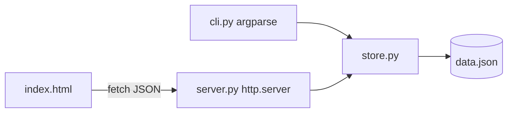

# Design: StudyStreak

## Overview
Three thin layers over one store module. Standard library only.



## Data model
```python
@dataclass
class Session:
    id: str        # uuid4 hex
    subject: str   # 1..60 chars, trimmed
    minutes: int   # 1..1440
    date: str      # ISO YYYY-MM-DD, not in the future
    note: str = "" # 0..200 chars
```
File format: `{"version": 1, "sessions": [ ...Session dicts... ]}`

## store.py
- `ValidationError(ValueError)` for bad input.
- `make_session(subject, minutes, date=None, note="", today=None) -> Session` validates and builds.
- `Store(path)`: `load()`, `add(...)`, `list()`, `delete(id) -> bool`, `stats(today=None) -> dict`.
- `compute_streak(dates: set[date], today: date) -> int`.
- `save()` writes to `path.tmp` then `os.replace` for atomicity.
- `today` is injectable everywhere so date logic is testable.

## server.py API (127.0.0.1:8765)
| Method | Path | Body | Response |
|---|---|---|---|
| GET | / | | index.html |
| GET | /api/sessions | | `[Session]` |
| POST | /api/sessions | `{subject, minutes, date?, note?}` | 201 `Session` / 400 `{error}` |
| DELETE | /api/sessions/{id} | | 204 / 404 `{error}` |
| GET | /api/stats | | `{total_minutes, sessions, by_subject, streak}` |

Request bodies are capped at 10 KB. Unknown paths return 404.

## Error handling
- Validation errors map to exit code 2 in the CLI and HTTP 400 in the API.
- Corrupt JSON file: raise a clear error naming the file instead of overwriting user data.

## Testing
- `test_store.py`: validation boundaries, persistence round-trip, delete, stats grouping, streak cases.
- `test_server.py`: start `ThreadingHTTPServer` on port 0 in a thread, exercise every endpoint.
